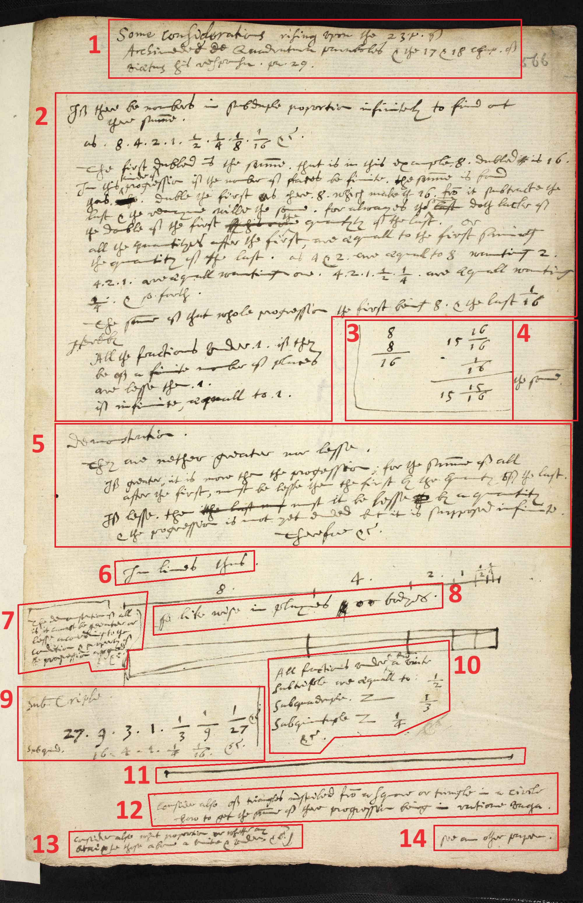

# Notre Dame workshop series: "How do we make Thomas Harriot digitally legible?"

To cite this paper, please use: [https://doi.org/10.17605/OSF.IO/5W8G4](https://doi.org/10.17605/OSF.IO/5W8G4).

## Background

Notre Dame hosted a series of workshops in the spring of 2023 to transcribe and annotate the esoteric manuscript writings of early-modern English polymath Thomas Harriot. Harriot's papers feature a mixture of English and Latin (often used idiosyncratically), archaic mathematical formulae, and hand-drawn images wrapped in a non-linear sequence, and hence they call for significant scholarly annotation. For the purposes of the Unlocking Digital Text project, the Harriot papers serve as an advantageously difficult use case for considerations of referenceability in the development of an Interoperable Text Framework (ITF).

Previously, Notre Dame project lead Robert Goulding had worked with Jacqueline Stedall and Matthias Schemmell, among others, to develop [The Manuscripts of Thomas Harriot (1560–1621) project](https://echo.mpiwg-berlin.mpg.de/content/scientific_revolution/harriot) hosted at the Max Planck Institute for the History of Science. This effort combined page scans with a custom XML transcription system to represent Harriot's manuscripts. While functional, the system has proven unwieldy, difficult for continued contribution, and susceptible to long-term sustainability concerns. The Notre Dame team therefore wished to explore a "lighter" transcription and annotation system. They eventually settled on productivity and note-taking software [Notion](https://www.notion.so) because it provides an easy, collaborative front end with relatively straightforward output of content to markdown, from which other derivatives can be created. Additionally, it provides an opportunity to test how an ITF might reference text from a content management system.

## The Notre Dame Workshops: Mechanics

Workshop collaborators both local and online (connected via the web-conferencing software Zoom) "convened" at the Visualization Lab in the Hesburgh Libraries' Navari Family Center for Digital Scholarship to capture transcriptions and annotations of Thomas Harriot's papers. Project PI Robert Goulding served as "conductor," focusing attention of local and remote attendees to selected page ranges, and leading discussion on interpretation and conjecture. This was a relatively tech-lite role. To guide participants, he sometimes used a Google Jamboard — a touch-based virtual whiteboard connected with the Google Drive ecosystem — to manipulate individual page scans, and zoom and rotate them as needed. Due to technical difficulties, he more often relied on the room's large projector screens, which someone else "piloted," most often Notre Dame postdoc Arnaud Zimmern. The Harriot Project's postdoctoral research associate, Caterina Agostini, organized the sessions. She also printed apropos Harriot materials in large format for closer examination, and brought appropriate scholarly monographs for reference. Both postdoctoral scholars provided intellectual contributions alongside project management support. Library faculty members Daniel Johnson and Natalie Meyers provided additional technology support, and especially, user experience documentation (to which Agostini also contributed).

Attendees across the four workshop sessions included (by institution and role):

+ Caterina Agostini, Robert Goulding, Arnaud Zimmern (University of Notre Dame; coordination, project development, transcription/interpretation)
+ Daniel Johnson, Natalie Meyers (University of Notre Dame; notes and observations)
+ Amir Alexander (UCLA; transcription/interpretation)
+ Angela Axworthy, Matthias Schemmel (Max-Planck-Institut Für Wissenschaftsgeschichte; transcription/interpretation)
+ Makiko Okamura (Kyoto Prefectural University; transcription/interpretation)
+ Stephen Clucas (Birkbeck, University of London; transcription/interpretation)
+ Jeremy Gray (independent; transcription/interpretation)

Workshop dates were:

+ 2023-02-10
+ 2023-02-24
+ 2023-03-10
+ 2023-03-17

## Observations   

The transcription sessions lasted about 75 minutes: long enough to capture multiple pages with in-depth discussion, but not so long as to be fatiguing. With a few exceptions, the technology in its omnipresence seemed almost to blend into the background, more a function of the careful project management of Caterina Agostini and skillful piloting of Arnaud Zimmern than the technology itself, though advancements in software such as web conferencing and data capture significantly reduced technical overhead.

Part of the preparation was coordination of the zones of activity. One of the room's three large projector screens was dedicated solely to Zoom web participants. Another displayed the page images. The third was the editing area in Notion. Here, the necessity of a digitally-adept humanities scholar was most clearly on display. Capturing interpretations of content on the page required careful listening for consensus readings (sometimes of English, sometimes of Latin) among local and remote participants, a sense for how to annotate conjectures rather than certainties (and to do so consistently), and, most impressively, the ability to render archaic mathematical formulations into LaTeX (sometimes live). Often in the midst of this listening and rendering, Zimmern also manipulated the image on the middle screen or pulled out a section with screen capture to paste as a closeup in the editing area in order to aid the conjecture. Without a skilled digital pilot, the technical machinery would have significantly slowed the natural and easy progress of the scholars.

When all of the technology was working correctly, Goulding directed attention by means of the Google Jamboard. The device interfaced with [Jamboard whiteboarding software of the same name](https://jamboard.google.com/?pli=1), which allowed project team members to assemble a selection of Harriot page scans into a slideshow format. This slideshow was simulcast on the Visualization Lab's second screen (the page scans area) and virtually to the Zoom participants. With the touchscreen, Goulding would zoom into sections of the page, use drawing tools to highlight parts of the text, and rotate the image as needed. The problem was that the Jamboard software would become unsynced from the Jamboard device, either delaying response to Goulding's manipulations or sometimes stopping updates altogether. It was a promising technology that ultimately failed to deliver consistently — and indeed, [the software is slated to be removed permanently by Google in December 2024](https://support.google.com/jamboard/answer/14084927?hl=en).

With the near ubiquity of web conferencing in recent years, it is easy to overlook just how helpful software such as Zoom is in enabling focused simultaneous scholarly activity. One user experience summary note taken by Natalie Meyers on Feb. 10 could be applied to the workshop series as a whole: group members are "mutually suggesting and transcribing and correcting & agreeing with one another before Arnaud types / corrects according to their agreement." Multiple quotations from this session are enlightening:

> Transcribing together serendipitously
>   
> Contributing and discussing difficult sections  as they read aloud and laugh and agree  
> 
> And then talk of of minute signs and  
> 
> Now transcribing fragments  
> 
> Arnaud is selecting fragments and pulling them out and Robert guiding the read-aloud and others chiming in.
>   
> Now a new page 6783 f125 - time spent enlarging and positioning the image on the shared jam board.  
> 
> Robert comments on how great it is to have the large physical printouts - consults one.   
> 
> Transcription begins  
> 
> It’s a troubling section but together they mutually agree how to transcribe  
> 
> Complete it and joke “quite tricky that one” and "[don’t know] what it means” but they are in mutual agreement it is transcribed as correctly as can be. 

The utility of having multiple technologies with multiple ways of viewing a text-in-dispute is illustrated by notes from Mar 10 (as is some of the persisting difficulty of hybrid participation):

> Questions about how to cover all the little additions and marginal pieces. In particular, the order of how the text progresses is debated. Zimmern takes screen cap of left side marginal note to paste into Notion for transcription. There is basically a double version of images and details: on Jamboard and Notion, based on participants preferring/using one (and excluding the other).
>> UX observer’s opinion: In difficult marginalia, several people speak at the same time, which makes it somewhat difficult to follow.  
> 
> Note: such cases may present a referencing challenge for an ITF, as well.
>
> Transcription of body text
> 
> Next, transcription of next lines down left margin.

In sum, despite a few challenges here and there, the hybrid transcription and interpretation program worked well and proceeded at a pace that previously would have taken months or years. The product of that work has given some opportunity for thinking about implications for an Interoperable Text Framework API.

## Reflection: Considerations for an ITF from the Harriot Project

Navigating Harriot’s pages is difficult for human readers and will be difficult for an API. At a basic parsing level, learning how to “chunk out” a page takes time. Take, for example, [the page MS 6786, f566r](https://harriot.notion.site/Add_ms_6787_f566r-Transcription-Page-6c1a855fe1454741b7bd350079de6dd3) below.

The red numbered zones reflect the order of the transcription as recorded on the Notion site. Not exactly intuitive. One might imagine trying to describe the flow of text from box 6 to 7 in plain speech: *"See the bit of text standing by itself in the middle of the page? Go just past that. No, not to the number-line diagram, to the text chunk. Well, not the text chunk below the number line, the marginal text to the left of it, and **then** to the text block beneath the number line."*

Figuring out how to reference the items on the page computationally is equally challenging. In a heavily-encoded XML-TEI transcription, lines could be enumerated and cross-referenced with extensive metadata, but at the cost of much greater development time. For a “light-weight” solution like Notion, the challenge is stiffer. Even a cop out, such as allowing only the return of the entire page of text rather than a specific chunk of text, would present issues: how, for example, would the LaTeX code be handled? As a rendered image? As an unremarked plain text transcription of the code? Or perhaps text specially flagged somehow as containing code which the user needs to render?

The deeper challenge of referencing specific parts of the text would require digging into the internals of the content management system, which is subject to change with every new update to the CMS. In the case of Notion, an API could not simply parse the html of the URL because the site uses JavaScript to populate content, so the API would need to be configured to access the fully-rendered Document Object Model (DOM). The good news upon looking closely at the Notion-rendered DOM is that each line of text appears to be identified with its own unique "data-block-id" attribute and that there is also a class-attribute of "katex-mathml" which demarcates the LaTeX coding. With such information, the developer of the ITF API could configure the system to return text properly, and could even return individual words on the logic of simple counting: "return word #3 of the line identified as 2kJ32-46."

This presents a usability challenge, however. It is one thing to teach an API how to reference the correct attribute, but another to teach an end user how to find the correct identifier inside that attribute. Scholars who wish to use an ITF API to bring Harriot content into their projects may not know how to access their browser's developer tools to tinker with the DOM and find the proper ID. The process would be fiddly in the best case. It would be most helpful, then, if the ITF offered not only an API, but a "helper tool" of some kind that would enable an end user to select a portion of text from a given CMS (such as Notion, Wordpress, etc), and get back the appropriate identifiers, which they could could copy-paste into their API call.

One final challenge to highlight is editorial. The editors of Harriot chose to mark regular line breaks with a singular pipe character "|" and paragraph breaks with two pipes "||" at the end of a line of text. Should the API return the pipe characters unremarked? Or should it be configured to "know" the meaning of this convention? If so, how can the editors of the edition communicate their house editorial rules to the ITF team so that the meaning can be known by the API? Or should the designers of the API establish a base set of ITF rules that text projects should adhere to, in order to be fully compliant with the API?

If these challenges were solved, the utility of an ITF API would shine through in the example above. One might imagine that the calculations in box 3 illustrate a concept not immediately following from the content in text box 2, and are perhaps part of a larger sequence that is shown and described on 12 additional pages across Harriot’s notebooks. It would be immensely helpful to be able to see this relationship laid out. An API that could be used to retrieve a text chunk and place it in sequence with other appropriate text chunks would allow scholars to make multiple interpretive "transcripts" of different concepts, similar to how IIIF manifests allow scholars to place in close contiguity graphical elements from different pages or different manuscripts altogether to make an argument about pictorial themes.

The Harriot Project Notion page is currently available here: [https://harriot.notion.site/De-Infinitis-Home-Page-be55c1eef00a4fad964da260d89128d0?pvs=73](https://harriot.notion.site/De-Infinitis-Home-Page-be55c1eef00a4fad964da260d89128d0?pvs=73). 